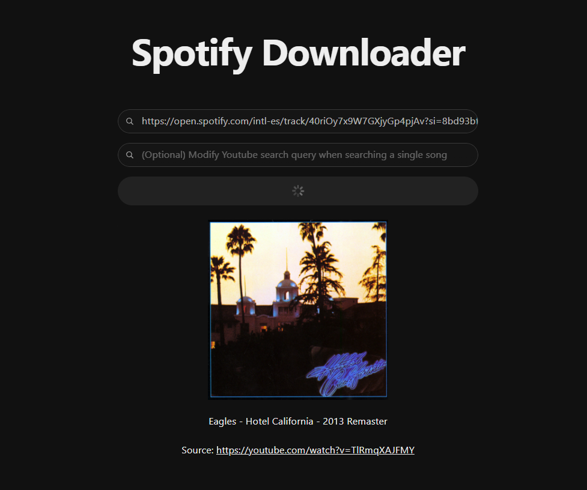

# SpotifyDownloader

A web that downloads an entire playlist, or a single song from Spotify, by providing their link.

&nbsp;

## Landing Page

&nbsp;

The code identifies the song using the Spotify API, then creates a search query for Youtube, and then downloads the first result. An additional field is provided to substitute the search query sent to Youtube, in case a song is not identified properly. In this case, the song will have the correct metadata, but it will not be used to form the query.

&nbsp;

# Technologies Used:

-   **Languages:**

    -   JavaScript
    -   HTML
    -   CSS

-   **Frameworks / Utilities:**

    -   React
    -   Node.js
    -   Radix UI
